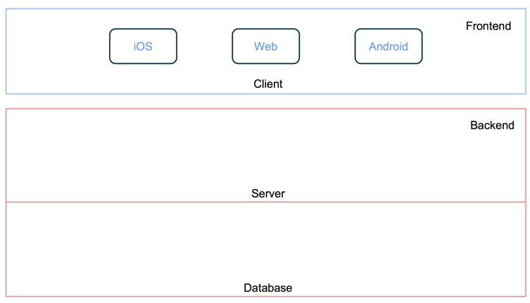
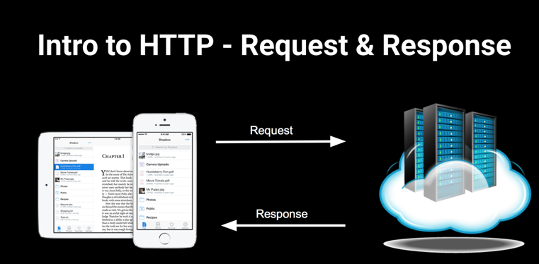
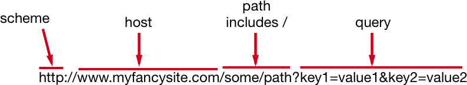
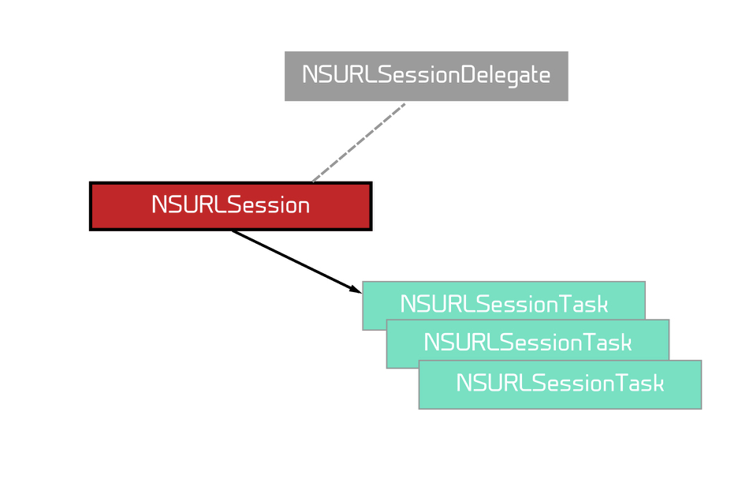

# Networking

## Servers



* Servers are ordinary computers that run applications on a network.



* Servers listen to a specific port from which they receive client requests and to which they give a response.
* Servers and clients on the internet communicate using the HTTP protocol (there are other protocols such as FTP, WebSocket, etc.)
* Web servers host web resources, such as HTML, PDF, JSON.
* Client applications request these resources through the server.
* Resources can be either static or dynamic.
* Dynamic resources are created by applications that run on the server (and client) and assemble things on the fly.
* Server sends a response back to the client with the resource if it could fulfill the request, otherwise it will give some information about what went wrong with processing the request.

---

## Basic HTTP Status Codes

### 2XX => Successful

### 3XX => Redirection

### 4XX => Bad Request (Syntax error)

### 5XX => Server Error

### Reference

[Status Code Definitions](http://www.w3.org/Protocols/rfc2616/rfc2616-sec10.html)

---

## Statelessness

* Once the response is sent, the server closes the connection and doesn't track anything about the client.
* The HTTP protocol is called "stateless" for this reason.
* Statelessness means that if the same client sends the same request again, the server treats it as a brand new request from a brand new client.
* One request/response cycle is called a "transaction".

## Some URL Basics



* Foundation has a url class called `NSURL` (Swift 3+ `URL`).
* `NSURL` can be used for any `URI` including file paths.

## URL Encoding

* `URL's` for historical reasons can only consist of a delimited subset of ASCII characters.
* These are A-Z a-z 0-9 and $ - . + ! * ‘ ( ) , and some reserved characters like : //
* If a url just uses the accepted ASCII characters it can be used unencoded.
* `URL encoding` converts characters that are not permitted in urls into a format that can be transmitted over the net.
* Encoding replaces unsafe characters with % followed by 2 hex digits. (eg. `%20` is a space).

## Use `NSURLComponents`

* On the Apple platform it is best practice to use `NSURLComponents` object to generate an `NSURL` which handles encoding automaticly. 🍟
* `NSURLComponents` also gives us other benefits, for instance, it helps us easily parameterize our url creation. Please don't use `stringWithFormat:` to generate strings.

```objc
// Create URL
NSURLComponents *components = [NSURLComponents componentsWithString: @"http://mycoolsite.com"];

components.path = @"/my/path";
components.query = @"key1=value"; // better to use the `NSURLQueryItem` class rather than a String literal
NSURL *url = components.URL; // gets the NSURL instance: http:mycoolsite.com/my/path/?key1=value

// Reading it
components.scheme; // http
components.host; // http://mycoolsite.com
components.path; // /my/path
components.queryItems.count; // 1
components.queryItems[0].name; // "key1"
components.queryItems[0].value; // "value"
// adding some spaces to the path to show encoding
components.path = @"/path with space";
components.URL; //http:mycoolsite.com/path%20with%20space/?key1=value
```

---

## HTTP Protocol Request Methods & REST

> The http protocol has a bunch of request methods.
* **GET => Retrieves data**
* **POST => Mostly used for submitting web forms and uploading data**
* **HEAD => Same as GET except you don’t get the response body**
* **PUT => Modifying an existing resource (update)**
* **DELETE => Deleting**

* `REST` is a very common architecture/style of exposing an application sitting on a server. (It’s the dominant style of exposing a web backend.)
* `REST` mimics the `HTTP protocol` and uses the same request methods, but don’t confuse the two.

---

## Network Tool

* When writing networking code, you want to start by making sure your network requests work before writing the code! Why?
* To do this we usually use a command line tool like `CURL` or a GUI.
* The client I’m going to use is Paw which is a *native* Mac app. You can download a 30 day trial here: [https://paw.cloud](https://paw.cloud])
* People also like PostMan, which is free. Download it [here](https://www.getpostman.com/apps).
* Another option is `Rested` which is free on the app store [here](https://itunes.apple.com/ca/app/rested-simple-http-requests/id421879749?mt=12).

---

## `NSURLSession`

* The `NSURLSession` class and related classes provide an API for downloading content.
* You normally create a session instance with an instance of `NSURLSessionConfiguration`.

```objc
+ (NSURLSession *)sessionWithConfiguration:(NSURLSessionConfiguration *)configuration;
```

* `NSURLSessionConfiguration` allows you to control things like timeouts, caching, etc.
* Once you have an instance of `NSURLSession`, create individual `NSURLSessionTask`s to transfer data to and from the network.
* Don't create a new `NSURLSession` for each task. The session can be used for any number of tasks that share the same configuration.
* You handle responses using either block callbacks, or delegates. Typically you only use delegates for tasks that you need to monitor progress on or handle authentication workflows. We won't be using the delegate today.



* For simple `GET` requests you can create an `NSURLSession` *without* a configuration using the `sharedSession` class property.

```objc
@property(class, readonly, strong) NSURLSession *sharedSession;
```

* `NSURLSessionConfiguration`s comes in 3 flavours: default, ephemeral, and background.

```objc
@property(class, readonly, strong) NSURLSessionConfiguration *defaultSessionConfiguration;
@property(class, readonly, strong) NSURLSessionConfiguration *ephemeralSessionConfiguration;
+ (NSURLSessionConfiguration *)backgroundSessionConfigurationWithIdentifier:(NSString *)identifier;
```

* Any changes you make to the configuration must be done before passing it to the `NSURLSession` initializer.
* iOS 11 adds the `waitsForConnectivity` property to the configuration which you should almost always set to `YES`.
* To add tasks to the `NSURLSession` instance you will call one of the many methods to add either a simple data task, upload task, or download task.
* Different ways of adding tasks create different subclasses of the "abstract class" `NSURLSessionTask`.
* Foundation has 3 concrete subtypes of `NSURLSessionTask`:
  1. `NSURLSessionDataTask` used for in memory response (background downloading not supported)
  1. `NSURLSessionUploadTask` used because it is easier to add a request body when uploading
  1. `NSURLSessionDownloadTask` which allows writing to disk.
* When creating a task without a completion handler you're expected to hook up a delegate to get callbacks.
* When adding tasks the methods can either take an `NSURL` or an `NSURLRequest` instance.
* For simple `GET` requests you can use the `NSURL` parameter.
* Methods taking an `NSURLRequest` instance are required when you need to specify requests that aren't `GET` and when you need to pass things like a body and header info.
* Tasks are created in a paused state. So you must remember to call `resume` to start the request. This is a common gotcha.
* You should call `- (void)finishTasksAndInvalidate;` on the session to make sure sessions are properly closed.

### Main Queue

* `NSURLSession` uses background threads to get data. Does anyone know why?
* We will talk about concurrency another day. For now all you need to know is that we must know how to switch back to the `Main thread` when we update our interface since our interface is rendered on the `Main thread`.
* There are a couple of ways to get ahold of the main queue in Objective-C. To keep it simple, I'm going to just show one way, the most common way (using the C API).

```objc
void dispatch_async(dispatch_get_main_queue(), ^{
  // run code that updates the interface inside this block
});
```

[Objective-C Block Syntax Help](http://fuckingblocksyntax.com)

---

## `NSJSONSerialization`

* We will be mostly sending and receiving `JSON` during networking.
* These `JSON` packets are sent by serializing and deserializing them to and from `NSData`.
* To serialize and deserialize `JSON` we use the `NSJSONSerialization` class.
* It has 2 important class methods:

```objc

// deserializes (converts) an NSData with underlying JSON to a foundation object (NSDictionary or NSArray)

+ (id)JSONObjectWithData:(NSData *)data options:(NSJSONReadingOptions)opt error:(NSError * _Nullable *)error;

// serialize (covert) a foundation object (NSDictionary or NSArray) to an `NSData` object to send over the wire to someone expecting a JSON payload

+ (NSData *)dataWithJSONObject:(id)obj options:(NSJSONWritingOptions)opt error:(NSError * _Nullable *)error;

```

---

## Demo

* Let's use the iTunes search api in our demo. The details of how to use the api can be found here: </br> [https://affiliate.itunes.apple.com/resources/documentation/itunes-store-web-service-search-api/#searching](https://affiliate.itunes.apple.com/resources/documentation/itunes-store-web-service-search-api/#searching)

### Resources

* [URLSession Programming Guide](https://developer.apple.com/library/content/documentation/Cocoa/Conceptual/URLLoadingSystem/URLLoadingSystem.html)
* [Objective-C Block Syntax Help](http://fuckingblocksyntax.com)
* [Apple's Documentation on Working With Blocks](https://developer.apple.com/library/content/documentation/Cocoa/Conceptual/ProgrammingWithObjectiveC/WorkingwithBlocks/WorkingwithBlocks.html)
* [Status Code Definitions](http://www.w3.org/Protocols/rfc2616/rfc2616-sec10.html)